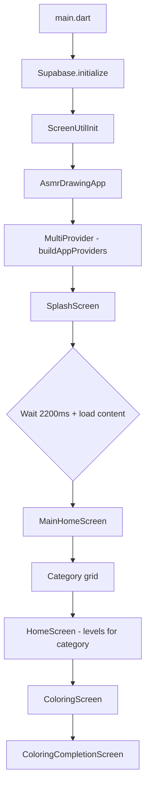

# AI Project Context — PlayCraft Kids (Coloring Page Drawing App)

> **Purpose:** This document gives AI assistants and new developers a complete, accurate picture of what the app does, how it is built, and where to change things. Read this before editing any feature.
>
> **Package:** `play_craft_kids` · **Version:** 1.0.0+3 · **Flutter SDK:** ≥ 3.0.0

---

## Table of Contents

1. [Executive Summary](#1-executive-summary)
2. [Critical Facts for AI](#2-critical-facts-for-ai)
3. [User Journey & Navigation](#3-user-journey--navigation)
4. [Two Coloring Engines (Important)](#4-two-coloring-engines-important)
5. [Feature Inventory](#5-feature-inventory)
6. [Architecture](#6-architecture)
7. [State Management & Dependency Injection](#7-state-management--dependency-injection)
8. [Data Layer](#8-data-layer)
9. [Backend (Supabase)](#9-backend-supabase)
10. [Rewards, Coins & Progression](#10-rewards-coins--progression)
11. [Audio & Settings](#11-audio--settings)
12. [Assets & Content Format](#12-assets--content-format)
13. [Screen & File Map](#13-screen--file-map)
14. [Key Classes Reference](#14-key-classes-reference)
15. [Common Modification Recipes](#15-common-modification-recipes)
16. [Known Legacy / Incomplete Areas](#16-known-legacy--incomplete-areas)
17. [Glossary](#17-glossary)

---

## 1. Executive Summary

**PlayCraft Kids** is an offline-first Flutter coloring app for children. Kids pick a category (Fruits, Animals, Alphabets, etc.), open a level, and color a black-and-white outline image using a brush. The app tracks progress, awards stars and coins, saves session history, and optionally syncs coins to Supabase when the user is logged in.

| Property | Value |
|---|---|
| Primary coloring UX | **Brush painting** on PNG outlines (`ColoringScreen` + `ColoringProvider`) |
| Secondary / legacy UX | **Tap-to-fill SVG regions** (`DrawingScreen` + `DrawingViewModel`) |
| State management | `provider` + MVVM (`ChangeNotifier` ViewModels) |
| Local storage | JSON files via `LocalStorageService` (platform-conditional IO vs stub) |
| Cloud | Supabase auth + `user_coins` + `coin_history` tables |
| Content source | Bundled JSON (`app_content.json`) + images in `assets/images/` |
| Orientation | All orientations allowed (set in `main.dart`) |
| Platforms | Android, iOS, Web, macOS, Linux |

---

## 2. Critical Facts for AI

These are the most common sources of confusion when working on this codebase:

### 2.1 There are TWO separate coloring systems

| System | Primary files | Interaction | Used by main flow? |
|---|---|---|---|
| **Pixel brush engine** | `ColoringProvider`, `ColoringScreen`, `canvas_widget.dart` | Drag brush to paint inside auto-detected regions from PNG outline | **YES** — `HomeScreen` opens `ColoringScreen` |
| **Region tap-fill engine** | `DrawingViewModel`, `DrawingScreen`, `canvas_widget.dart` (drawing/) | Tap predefined SVG/circle/oval/polygon regions to flood-fill | **Partially** — still wired from `RewardScreen` replay/next; not the default home flow |

Do **not** assume changes to `DrawingViewModel` affect the main coloring experience. Most users go through `ColoringProvider`.

### 2.2 Level launch sequence (main flow)

```
MainHomeScreen → tap category → HomeScreen (level grid)
  → on level tap:
      1. coloringProvider.setItem(activityItem, categoryId, level: level)
      2. Navigator.push → ColoringScreen(imagePath: level.imagePath)
  → ColoringBoard → CanvasWidget → ColoringProvider paints pixels
  → on complete → ColoringCompletionScreen (confetti, score, coins)
```

Relevant code in `lib/features/home/view/home_screen.dart` (~lines 228–250).

### 2.3 Auth is optional at runtime

- Supabase initializes in `main.dart` on every launch.
- Splash currently navigates directly to `MainHomeScreen` (login gate is commented out).
- Coin badge on `ColoringScreen` shows "Login" when logged out; tap opens `LoginScreen`.
- Daily bonus and coin sync only run when `auth.currentUser != null`.

### 2.4 Progress is stored in multiple places

| Data | File / table | Owner |
|---|---|---|
| Level completion, stars, last played | `asmr_drawing_progress.json` | `LocalContentService` |
| In-progress drawing sessions + thumbnails | `asmr_drawing_history.json` | `HistoryRepository` |
| Music / sound / haptics toggles | preferences via `AppPreferencesService` | `SettingsViewModel` |
| Coin balance (cloud) | Supabase `user_coins` | `HomeViewModel` |
| Coin transaction log (cloud) | Supabase `coin_history` | `HomeViewModel` |

### 2.5 Image naming conventions

| Pattern | Example | Purpose |
|---|---|---|
| `un_colored_{name}.webp` | `un_colored_apple.webp` | Outline for coloring |
| `un_border_{name}.webp` | `un_border_apple.webp` | Alternate outline (used in `activity.imagePath`) |
| `{name}.webp` | `apple.webp` | Colored reference for score comparison |
| `marker*.png` | `marker.png`, `marker1.png` | Brush skin images |

`ColoringProvider._getColoredImagePath()` and `getColoredImagePath()` in `coloring_screen.dart` map outline paths to reference images, with special-case filename fixes (e.g. `rabbit.webp` → `Rabbit.webp`).

---

## 3. User Journey & Navigation

### 3.1 Route table

Defined in `lib/app/routes/app_routes.dart`:

| Route constant | Path | Screen | Arguments |
|---|---|---|---|
| `AppRoutes.splash` | `/` | `SplashScreen` | — |
| `AppRoutes.mainHome` | `/main-home` | `MainHomeScreen` | — |
| `AppRoutes.home` | `/home` | `HomeScreen` | — |
| `AppRoutes.drawing` | `/drawing` | `DrawingScreen` | `DrawingRouteArgs` |
| `AppRoutes.levels` | `/levels` | `LevelScreen` | — |
| `AppRoutes.skins` | `/skins` | `SkinsScreen` | — |
| `AppRoutes.settings` | `/settings` | `SettingsDialog` | — |
| `AppRoutes.privacy` | `/privacy` | `PrivacyScreen` | — |
| `AppRoutes.reward` | `/reward` | `RewardScreen` | `RewardRouteArgs` |

**Note:** `ColoringScreen` and `ColoringCompletionScreen` are **not** named routes — they are pushed via `MaterialPageRoute`.

### 3.2 App startup flow



### 3.3 Bottom navigation (`CustomBar`)

Located in `lib/features/home/components/custom_bar.dart`:

| Tab | Icon | Action |
|---|---|---|
| Home | `home.webp` | Stay on main home |
| Gallery / History | `photo.png` | Persist history snapshot → navigate to `LevelScreen` |
| Coins | 🪙 emoji | If logged in → `CoinHistoryScreen`; else → `LoginScreen` |
| Settings | `setting.png` | Opens settings dialog |

---

## 4. Two Coloring Engines (Important)

### 4.1 Pixel Brush Engine — `ColoringProvider` (PRIMARY)

**Location:** `lib/features/coloring/viewmodel/coloring_viewmodel.dart` (~1600 lines)

This is the engine kids actually use from the home screen.

#### How it works

1. Load outline PNG from `ActivityItem.imagePath` (e.g. `assets/images/un_border_apple.webp`).
2. Downsample to **640×640** working canvas.
3. **Outline detection:** dark pixels → outline mask (painting blocked).
4. **BFS flood-fill from image borders** → marks "outside" pixels.
5. **Inside mask** = not outline AND not outside → each enclosed cavity becomes a natural paint region (head, body, leaf, etc.) — **no manual region JSON needed for painting**.
6. User drags brush; only `_isInside` pixels in the **active region** get painted.
7. Full-resolution outline composited on top with `BlendMode.multiply` for sharp lines.
8. **Part-by-part mode:** regions are visited sequentially; child colors one cavity at a time with auto-zoom to active part.
9. **Scoring:** compares painted pixels against colored reference image (`_referencePixels`) using color matching (`_isColorMatch`).
10. On all parts complete → `ColoringCompletionScreen` runs image diff (`diff_image2`, `image` packages) for match percentage.

#### Key state

| Field | Purpose |
|---|---|
| `_pixels` | 640×640 RGBA buffer user paints into |
| `_isInside` | Paintable interior mask |
| `_orderedParts` | Auto-detected regions in paint order |
| `_activeRegionIndex` | Current part being colored |
| `_completedRegionIds` | Finished parts |
| `_referencePixels` | Colored reference for accuracy scoring |
| `_undoStack` | Full pixel snapshots before each stroke |

#### Key methods

| Method | Purpose |
|---|---|
| `setItem(ActivityItem, categoryId, {level})` | Configure activity; triggers `_loadImage()` |
| `_loadImage()` | Build masks, parts, palette from PNG |
| `onPanStart/Update/End` | Brush painting gestures |
| `undo()` | Restore previous pixel snapshot |
| `calculateScore()` | Compute stars and percentage |
| `captureMasterpiece(Size)` | Export finished artwork as `ui.Image` |
| `isPartByPartComplete` | All `_orderedParts` colored |

#### UI stack

```
ColoringScreen
  └── ColoringBoard (controls: undo, brush size, clear)
        └── CanvasWidget (InteractiveViewer + gestures + auto-zoom)
              └── CustomPainter (coloredImage + highlight + outline overlay)
```

---

### 4.2 Region Tap-Fill Engine — `DrawingViewModel` (SECONDARY / LEGACY)

**Location:** `lib/features/drawing/viewmodel/drawing_viewmodel.dart`

Used by `DrawingScreen` — a guided multi-phase canvas with SVG-defined regions from JSON.

#### How it works

1. Load `LevelModel` from `DrawingRepository` → `LocalContentService`.
2. Regions defined in JSON as `circle`, `oval`, `polygon`, or `path` (SVG).
3. `FillAlgorithm.locateRegion()` hit-tests tap point against regions (reverse order = topmost first).
4. `fillRegionAt(regionId)` sets `filledRegions[regionId] = selectedColor`.
5. Undo/redo via `DrawingAction` stack.
6. Completion when all regions filled → star calculation based on undo count.
7. Accuracy ≥ 70% required to persist completion via `markLevelCompleted()`.
8. `checkExcellence()` — all regions match target colors → 100-coin bonus.

#### Star rules (DrawingViewModel)

| Undo count | Stars |
|---|---|
| 0 | ⭐⭐⭐ (3) |
| 1–2 | ⭐⭐ (2) |
| 3+ | ⭐ (1) |

#### Guided phases (DrawingScreen)

`DrawingScreen` adds a **guided painting flow** on top of `DrawingViewModel`:

- `GuidedCanvasPhase.outline` → preview/trace phase
- Coloring phase with part highlighting via `ActivePartHighlighter`
- Completion celebration + accuracy dialog
- Navigates to `RewardScreen` with captured artwork bytes

---

### 4.3 Tracing Engine — `TracingProvider` (LEGACY / OPTIONAL)

**Location:** `lib/features/tracing/viewmodel/tracing_viewmodel.dart`

Letter/shape tracing along reference paths. Screens exist (`TracingScreen`, `TracingCompletionScreen`) but tracing was **removed from the main drawing toolbar**. `LevelModel.activityItem` still carries tracing metadata in JSON. Do not assume tracing is active in the primary user path.

---

## 5. Feature Inventory

### 5.1 Splash

| Item | Detail |
|---|---|
| Files | `lib/features/splash/view/splash_screen.dart`, `splash_viewmodel.dart` |
| Behavior | Shows animated splash; waits `AppConfig.splashDelayMs` (2200 ms); preloads home content |
| Next screen | `MainHomeScreen` (auth check bypassed) |

### 5.2 Home & Categories

| Item | Detail |
|---|---|
| Main entry | `MainHomeScreen` — category grid with themed cards |
| Level list | `HomeScreen` — grid of levels for selected category |
| ViewModel | `HomeViewModel` — categories, lock state, coins, daily bonus |
| Categories (7) | `fruits` (30), `alphabets` (26), `animal` (30), `vegetables` (30), `wild_animals` (30), `colors` (30), `drawing` (30) = **206 base levels** |
| Extra content | `realistic_content_pack.json` merged at runtime into matching categories |
| Continue playing | `continueLevel` = last played or first incomplete level |
| Daily pick | `dailyLevel` = first incomplete level across all categories |

### 5.3 Coloring (Primary Gameplay)

| Item | Detail |
|---|---|
| Screen | `ColoringScreen` |
| Engine | `ColoringProvider` |
| Controls | Color palette, brush size slider, undo, clear, preview reference, settings |
| Completion | `ColoringCompletionScreen` — confetti, animated stars, coin award, image diff score |
| Share | Completion screen can share/save artwork |

### 5.4 Drawing (Secondary Gameplay)

| Item | Detail |
|---|---|
| Screen | `DrawingScreen` (~1700 lines) |
| Engine | `DrawingViewModel` + guided controllers |
| Features | Tap-to-fill regions, undo/redo, reset, guided part highlighting, history auto-save |
| Completion | Routes to `RewardScreen` |

### 5.5 Levels Screen

| Item | Detail |
|---|---|
| File | `lib/features/levels/view/level_screen.dart` |
| Purpose | Alternative level browser (opened from bottom bar gallery tab) |
| Also opens | `ColoringScreen` with same `setItem` + `imagePath` pattern |

### 5.6 Rewards

| Item | Detail |
|---|---|
| Screen | `RewardScreen` — confetti, Lottie (`celebrate.json`), share artwork |
| ViewModel | `RewardViewModel` — aggregates completed level coin totals |
| Navigation | Replay/next level go to `DrawingScreen` (not `ColoringScreen`) |
| Skin unlock | `SkinsViewModel.unlockByLevel(levelNumber)` on next level |

### 5.7 History

| Item | Detail |
|---|---|
| Model | `DrawingHistoryEntry` — id, levelId, progress, snapshot, thumbnail (base64) |
| Repository | `HistoryRepositoryImpl` — JSON file with isolate-based encode/decode |
| ViewModel | `HistoryViewModel` |
| Used by | Drawing flow session restore; gallery tab triggers snapshot persist |

### 5.8 Skins

| Item | Detail |
|---|---|
| Screen | `SkinsScreen` |
| ViewModel | `SkinsViewModel` |
| Catalog | `SkinCatalog` — marker PNG variants |
| Unlock | Every 5 levels (`unlockByLevel`) |

### 5.9 Settings

| Item | Detail |
|---|---|
| UI | `SettingsDialog` modal |
| ViewModel | `SettingsViewModel` |
| Toggles | Music, sound effects, haptic feedback |
| Storage | `AppPreferencesService` → local preferences file |

### 5.10 Sound

| Item | Detail |
|---|---|
| Service | `SoundService` (`lib/features/sound/services/sound_service.dart`) |
| Background | Loops `assets/audio/piano_bg.mp3` |
| SFX | `assets/audio/click.mp3` on fill/tap |
| Lifecycle | Pauses audio when app backgrounded |

### 5.11 Auth

| Item | Detail |
|---|---|
| Screens | `LoginScreen`, `SignupScreen` |
| Backend | Supabase email/password auth |
| Sign-up bonus | `HomeViewModel.addWelcomeBonus()` — 50 coins to `coin_history` |
| Components | `CustomTextField` |

### 5.12 Coins & History UI

| Item | Detail |
|---|---|
| Model | `CoinHistory` in `lib/features/home/components/coins_history.dart` |
| Screen | `CoinHistoryScreen` |
| Fetch | `HomeViewModel.fetchCoinHistory()` — lists transactions, recalculates total |

### 5.13 Privacy

| Item | Detail |
|---|---|
| Screen | `PrivacyScreen` — in-app policy text |

### 5.14 Ads

| Item | Detail |
|---|---|
| Service | `AdMobService` — **stub only**, no real AdMob integration |
| ViewModel | `AdsViewModel` |

---

## 6. Architecture

### 6.1 Pattern: MVVM + Provider

```
View (Widget)
    ↕ Consumer / context.watch / context.read
ViewModel (ChangeNotifier extends BaseViewModel)
    ↕ async calls
Repository (interface + Impl)
    ↕
Service (LocalContentService, SoundService, etc.)
    ↕
Local JSON files / Supabase / Asset bundle
```

### 6.2 BaseViewModel

`lib/core/base/base_viewmodel.dart` provides:
- `isLoading` / `setLoading()`
- `errorMessage` / `setError()`
- extends `ChangeNotifier`

### 6.3 Feature folder convention

```
lib/features/{feature}/
├── model/          # Data classes
├── repository/     # Abstract + Impl
├── viewmodel/      # Business logic
├── view/           # Screens
├── widgets/        # Feature-specific widgets
└── services/       # Feature services (optional)
```

### 6.4 Shared layer

```
lib/shared/
├── services/       # LocalContentService, LocalStorage, AppPreferences
├── widgets/        # CustomButton, Loader
├── components/     # Reusable UI (LevelPreview, etc.)
└── utils/          # interaction_feedback, etc.
```

### 6.5 Core layer

```
lib/core/
├── base/           # BaseViewModel
├── constants/      # AppColors, AppStrings, AppSpacing
├── di/             # providers.dart
├── network/        # NetworkInfo
└── utils/          # Helpers
```

---

## 7. State Management & Dependency Injection

All providers registered in `lib/core/di/providers.dart` via `buildAppProviders()`.

### 7.1 Singleton services (`Provider<T>`)

| Type | Purpose |
|---|---|
| `NetworkInfo` | Connectivity helper |
| `LocalStorageService` | File I/O (IO impl) or in-memory stub (web) |
| `AppPreferencesService` | User preference read/write |
| `LocalContentService` | Content loading + progress persistence + Supabase coin sync |
| `SoundService` | Audio (disposed on app close) |
| `AdMobService` | Ad stub |
| `HomeRepository` | Home content API |
| `LevelRepository` | Level queries |
| `DrawingRepository` | Level + completion for drawing flow |
| `HistoryRepository` | Session history CRUD |

### 7.2 Reactive ViewModels (`ChangeNotifierProvider`)

| ViewModel | Created | Notes |
|---|---|---|
| `SettingsViewModel` | Eager `ensureLoaded()` | |
| `SplashViewModel` | Lazy | |
| `HomeViewModel` | Lazy, calls `load()` in constructor | |
| `DrawingViewModel` | Lazy | |
| `HistoryViewModel` | Lazy | |
| `RewardViewModel` | Lazy, calls `load()` | |
| `AdsViewModel` | Lazy | |
| `SkinsViewModel` | Lazy | |
| `ColoringProvider` | Lazy | **Global singleton** — state persists across level opens |

**Important:** `ColoringProvider` is a single app-wide instance. Always call `setItem()` before opening a new level, or stale image/state may appear.

### 7.3 Access patterns

```dart
// Rebuild on changes
context.watch<HomeViewModel>();

// One-time read in callbacks
context.read<DrawingViewModel>();

// Fine-grained (brush size only)
ValueListenableBuilder<DrawingBrushSize>(
  valueListenable: viewModel.brushSizeListenable,
  ...
);
```

---

## 8. Data Layer

### 8.1 Content loading pipeline

```
app_content.json
    ↓ parse → HomeContentModel
realistic_content_pack.json
    ↓ merge by category ID (dedupe by level ID)
LocalContentService._applyProgress()
    ↓ overlay isCompleted, stars from local progress
HomeViewModel.content / LevelRepository
```

### 8.2 LevelModel (JSON-driven regions)

**File:** `lib/features/levels/model/level_model.dart`

| Field | Type | Description |
|---|---|---|
| `id` | String | Unique level key |
| `title`, `subtitle` | String | Display text |
| `difficulty` | String | `"Easy"` / `"Medium"` / `"Hard"` |
| `rewardCoins` | int | Coins on completion |
| `recommendedBrushSize` | double | Suggested brush radius |
| `palette` | List\<DrawingColorModel\> | Available colors |
| `regions` | List\<LevelRegionModel\> | Tap-fill regions (DrawingScreen) |
| `guideAsset` | String? | Boy/girl prompt image |
| `previewImage` | String? | Card thumbnail |
| `imagePath` | String? | Colored reference image path |
| `activity` | ActivityItem? | Outline path + metadata for ColoringProvider |
| `isCompleted`, `stars` | bool, int | From local progress overlay |

#### Region shape types

| Type | JSON fields | Hit test |
|---|---|---|
| `circle` | `cx`, `cy`, `radius` (normalized 0–1) | `Path.contains()` |
| `oval` | `cx`, `cy`, `rx`, `ry` | `Path.contains()` |
| `polygon` | `points: [[x,y], ...]` | `Path.contains()` |
| `path` | `svgPath`, `viewBoxSize` | SVG parsed via `path_drawing` |

#### Target color resolution

`LevelModel.getTargetColorIdForRegion(regionId)`:
1. Use explicit `targetColorId` on region if set in JSON.
2. Else level-specific name heuristics (apple body → red, leaf → green, etc.).
3. Else match palette ID against region name substring.

### 8.3 Local progress file

**File:** `asmr_drawing_progress.json` (app documents directory)

```json
{
  "lastPlayedLevelId": "apple",
  "totalPoints": 350,
  "lastDailyBonusDate": "2026-06-11",
  "currentStreak": 5,
  "progress": {
    "apple": { "isCompleted": true, "stars": 3, "rewardCoins": 40 }
  }
}
```

Managed by `LocalContentService`.

### 8.4 History file

**File:** `asmr_drawing_history.json`

```json
{
  "entries": [
    {
      "id": "apple_1749648000000",
      "levelId": "apple",
      "levelTitle": "Apple",
      "status": "inProgress",
      "progress": 0.6,
      "lastEditedAt": "2026-06-11T10:00:00Z",
      "thumbnailBase64": "...",
      "snapshot": {
        "filledRegions": { "body": 4294901760 },
        "selectedColorId": "red",
        "brushSizeKey": "standard"
      }
    }
  ]
}
```

### 8.5 DrawingSessionSnapshot

Serializable canvas state for DrawingViewModel history restore:
- `filledRegions` (regionId → color int value)
- `selectedColorId`
- `brushSizeKey`

---

## 9. Backend (Supabase)

### 9.1 Initialization

Hardcoded in `lib/main.dart`:
- URL: `https://skywvbfwotpxlwiglxpl.supabase.co`
- Anon key: embedded in source (should be moved to env for production)

### 9.2 Tables

#### `user_coins`

| Column | Purpose |
|---|---|
| `user_id` | FK to auth.users |
| `coins` | Current balance |
| `updated_at` | Last sync |
| `description`, `type` | Optional metadata on upsert |
| `is_item_unlocked` | ≥ 100 coins |
| `is_stage_unlocked` | ≥ 200 coins |
| `is_premium_unlocked` | ≥ 500 coins |

#### `coin_history`

| Column | Purpose |
|---|---|
| `user_id` | Owner |
| `amount` | Transaction amount (10, 20, 50, etc.) |
| `description` | e.g. "Level Completion", "Daily Bonus", "Welcome Bonus" |
| `created_at` | Timestamp |

### 9.3 Coin flows

```
Level complete (ColoringCompletionScreen)
  → HomeViewModel.addCompletionPoints(20)
  → INSERT coin_history + UPSERT user_coins

Daily login (HomeViewModel.checkAndApplyDailyBonus)
  → +10 coins if not claimed today
  → INSERT coin_history + UPSERT user_coins

Welcome (signup)
  → HomeViewModel.addWelcomeBonus(userId)
  → +50 coins

Color match bonus
  → HomeViewModel.addColorMatchPoints()
  → LocalContentService.savePoints() with description
```

---

## 10. Rewards, Coins & Progression

### 10.1 Level locking

**File:** `HomeViewModel.isLevelLocked()` / `isLevelLockedAt()`

A level is **locked** when:
- It is not the first level in its category, AND
- The previous level is NOT completed, AND
- Previous level progress < **80%** (`unlockProgressThreshold`)

Progress comes from `HistoryRepository` in-progress sessions.

### 10.2 Coin values (approximate / current code)

| Event | Coins |
|---|---|
| Level completion (Supabase) | 20 (`addCompletionPoints`) |
| Daily bonus | 10 |
| Welcome bonus | 50 |
| Color match (local) | +10 to `_totalPoints` |
| Excellence (DrawingViewModel) | 100 bonus |
| Per-level JSON `rewardCoins` | 40 typical (varies by level) |

### 10.3 Star calculation

**DrawingViewModel:** based on undo count (see §4.2).

**ColoringProvider:** based on reference image match percentage and coverage in `calculateScore()`.

### 10.4 Completion persistence threshold

`DrawingViewModel._evaluateCompletion()` only calls `markLevelCompleted()` if `accuracyScore >= 0.70` (70% regions match target colors).

---

## 11. Audio & Settings

### 11.1 SoundService

| Method | Trigger |
|---|---|
| `startBackgroundMusic()` | App foreground + music enabled |
| `playFillFeedback()` | Region fill / paint action |
| `playCompletionFeedback()` | Level complete |
| `playTapFeedback()` | UI taps (with optional haptic) |

Audio assets:
- `assets/audio/piano_bg.mp3` — background loop
- `assets/audio/click.mp3` — tap SFX
- `assets/sounds/` — additional legacy sounds

### 11.2 Settings persistence

| Key | Default | Storage |
|---|---|---|
| `music_enabled` | true | AppPreferencesService |
| `sounds_enabled` | true | AppPreferencesService |
| `haptics_enabled` | true | AppPreferencesService |

---

## 12. Assets & Content Format

### 12.1 JSON content example (abbreviated)

```json
{
  "categories": [{
    "id": "fruits",
    "title": "Fruits",
    "levels": [{
      "id": "apple",
      "title": "Apple",
      "rewardCoins": 40,
      "imagePath": "assets/images/apple.webp",
      "activity": {
        "id": "apple",
        "imagePath": "assets/images/un_border_apple.webp"
      },
      "palette": [{ "id": "red", "label": "Red", "hex": "#E8242A" }],
      "regions": [{
        "id": "apple_body",
        "type": "path",
        "svgPath": "M50,24 C43,11 ..."
      }]
    }]
  }]
}
```

### 12.2 Adding a new level

1. Add outline PNG to `assets/images/` (e.g. `un_border_newitem.webp`).
2. Add colored reference PNG (e.g. `newitem.webp`).
3. Add level object to appropriate category in `app_content.json`.
4. Include `activity.imagePath` pointing to the outline.
5. Optionally define `regions` for DrawingScreen tap-fill mode.
6. Run `flutter pub get` (assets folder is directory-declared in pubspec).

### 12.3 Dependencies worth knowing

| Package | Used for |
|---|---|
| `provider` | State management |
| `supabase_flutter` | Auth + database |
| `audioplayers` | Sound |
| `path_drawing` | SVG region parsing |
| `lottie` + `confetti` | Celebration animations |
| `share_plus` | Share artwork |
| `flutter_screenutil` + `sizer` | Responsive sizing |
| `pixelmatch`, `image_hash`, `image_compare_2`, `diff_image2`, `image` | Coloring score / image diff |
| `google_fonts` | Typography |

---

## 13. Screen & File Map

### 13.1 Entry & shell

| Screen | File |
|---|---|
| App root | `lib/app/app.dart` |
| Main entry | `lib/main.dart` |
| Theme | `lib/app/theme/app_theme.dart` |
| Routes | `lib/app/routes/app_routes.dart` |
| DI | `lib/core/di/providers.dart` |

### 13.2 Features → primary files

| Feature | View | ViewModel | Repository/Service |
|---|---|---|---|
| Splash | `splash/view/splash_screen.dart` | `splash_viewmodel.dart` | via HomeRepository |
| Main Home | `home/view/main_home_screen.dart` | `home_viewmodel.dart` | `home_repository.dart` |
| Level grid | `home/view/home_screen.dart` | (HomeViewModel) | — |
| **Coloring** | `coloring/view/coloring_screen.dart` | `coloring_viewmodel.dart` | — |
| Coloring done | `coloring/view/coloring_completion_screen.dart` | — | — |
| Drawing | `drawing/view/drawing_screen.dart` | `drawing_viewmodel.dart` | `drawing_repository.dart` |
| Levels alt | `levels/view/level_screen.dart` | — | `level_repository.dart` |
| Reward | `rewards/view/reward_screen.dart` | `reward_viewmodel.dart` | — |
| History | — | `history_viewmodel.dart` | `history_repository.dart` |
| Skins | `skins/view/skins_screen.dart` | `skins_viewmodel.dart` | — |
| Settings | `settings/view/settings_screen.dart` | `settings_viewmodel.dart` | AppPreferencesService |
| Auth | `auth/view/login_screen.dart`, `sign_up_screen.dart` | — | Supabase direct |
| Privacy | `privacy/view/privacy_screen.dart` | — | — |
| Tracing | `tracing/view/tracing_screen.dart` | `tracing_viewmodel.dart` | — |

### 13.3 Coloring engine files (most edited)

| File | Role |
|---|---|
| `coloring/viewmodel/coloring_viewmodel.dart` | Pixel engine, masks, scoring |
| `coloring/widgets/canvas_widget.dart` | Gestures, zoom, painter |
| `coloring/widgets/coloring_board.dart` | Toolbar + canvas wrapper |
| `coloring/view/coloring_screen.dart` | Screen layout, header, navigation |
| `coloring/view/coloring_completion_screen.dart` | Post-game UI, coin award, diff score |

### 13.4 Drawing engine files

| File | Role |
|---|---|
| `drawing/viewmodel/drawing_viewmodel.dart` | Region fill logic |
| `drawing/view/drawing_screen.dart` | Guided UI flow |
| `drawing/view/widgets/canvas_widget.dart` | Region rendering |
| `drawing/services/fill_algorithm.dart` | Tap hit testing |
| `drawing/view/controllers/guided_painting_controllers.dart` | Phase controllers |

---

## 14. Key Classes Reference

### ActivityItem

**File:** `lib/features/tracing/viewmodel/activity_item.dart`

Bridge between JSON `activity` block and ColoringProvider:

```dart
ActivityItem({
  required String id,
  required String label,
  required String display,
  required Color color,
  required String imagePath,  // outline PNG path
});
```

### DrawingRouteArgs / RewardRouteArgs

**File:** `lib/app/routes/app_routes.dart`

```dart
DrawingRouteArgs({ required levelId, levelTitle?, levelNumber?, drawingSessionId? });
RewardRouteArgs({ required levelId, levelTitle, levelNumber, coins, stars, nextLevelId?, completedImageBytes? });
```

### CoinHistory

**File:** `lib/features/home/components/coins_history.dart`

Sanitizes historical bad data in `fromJson()` (forces known amounts for Welcome/Level/Daily descriptions).

---

## 15. Common Modification Recipes

### Change splash delay

`lib/app/config/app_config.dart` → `splashDelayMs`

### Add a new category

1. Add category block to `assets/data/app_content.json`.
2. Add category card image mapping in `MainHomeScreen` (~line 650) if custom icon needed.

### Change level unlock threshold

`HomeViewModel.unlockProgressThreshold` (currently `0.8`)

### Change daily bonus amount

`HomeViewModel.checkAndApplyDailyBonus()` — currently `10` coins.

### Wire auth gate on splash

Uncomment/modify `SplashViewModel.start()` to route to `LoginScreen` when `currentSession == null`.

### Make RewardScreen use ColoringScreen instead of DrawingScreen

Change `_openReplay` / `_openNext` in `reward_screen.dart` from `AppRoutes.drawing` to push `ColoringScreen` with `setItem()` — currently inconsistent with main flow.

### Add a new palette color to a level

Edit level's `palette` array in `app_content.json`. ColoringProvider also auto-extracts colors from reference image via `_extractPaletteFromReference()`.

### Persist coloring completion to local progress

Currently coloring completion goes through Supabase coins; local `markLevelCompleted()` may need explicit wiring from `ColoringCompletionScreen` if offline completion badges are required on home cards.

---

## 16. Known Legacy / Incomplete Areas

| Area | Status | Notes |
|---|---|---|
| `DrawingScreen` main flow | Legacy | Home opens `ColoringScreen`, not `DrawingScreen` |
| `RewardScreen` next/replay | Uses DrawingScreen | Inconsistent with home flow |
| Tracing UI | Removed from toolbar | ViewModels/screens still exist |
| `AdMobService` | Stub | No real ads |
| Supabase anon key | Hardcoded | Security risk for production |
| Debug `print()` statements | Many | Especially in HomeViewModel, LocalContentService |
| Commented dead code | Extensive | Especially home_viewmodel.dart, local_content_service.dart |
| `ColoringScreen` + `level` param | Underused | Home passes only `imagePath`; level passed via prior `setItem()` |
| README vs code | Some drift | README mentions portrait-only; main.dart allows all orientations |
| README sound paths | Drift | Code uses `assets/audio/` not `assets/sounds/` for main BGM |
| Hive in pubspec | Declared | Primary storage is custom JSON files, not Hive boxes |
| Skins UI | Partial | Unlock logic exists; full skin picker integration pending |

---

## 17. Glossary

| Term | Meaning |
|---|---|
| **Level** | One colorable item (apple, cat, letter A, etc.) |
| **Category** | Themed group of levels (fruits, animals, …) |
| **Region** | A fillable area — either JSON-defined (Drawing) or auto-detected cavity (Coloring) |
| **Activity / ActivityItem** | Metadata linking a level to its outline PNG |
| **Part-by-part** | Coloring mode where one cavity is active at a time |
| **Excellence** | All regions match exact target colors (DrawingViewModel) |
| **Snapshot** | Serializable in-progress canvas state |
| **Realistic pack** | Supplementary levels merged from second JSON file |
| **ASMR** | Design tone — satisfying sounds, calm UX, tap/fill feedback |

---

## Quick Reference: Where Is X?

| I need to change… | Go to |
|---|---|
| Category list / level JSON | `assets/data/app_content.json` |
| Which screen opens when tapping a level | `home/view/home_screen.dart` → `_openLevel()` |
| Brush painting behavior | `coloring/viewmodel/coloring_viewmodel.dart` |
| Tap-to-fill behavior | `drawing/viewmodel/drawing_viewmodel.dart` |
| Coin amounts | `home/viewmodel/home_viewmodel.dart` |
| Level lock rules | `home/viewmodel/home_viewmodel.dart` → `isLevelLockedAt()` |
| Supabase tables / sync | `shared/services/local_content_service.dart`, `home/viewmodel/home_viewmodel.dart` |
| Routes | `app/routes/app_routes.dart` |
| Provider registration | `core/di/providers.dart` |
| App colors | `core/constants/app_colors.dart` |
| User-visible strings | `core/constants/app_strings.dart` |
| Bottom navigation | `home/components/custom_bar.dart` |
| Settings toggles | `settings/viewmodel/settings_viewmodel.dart` |
| Background music | `sound/services/sound_service.dart` |

---

*Last updated: 2026-06-18. Generated from live codebase analysis. For human-readable setup instructions see root `README.md`.*
